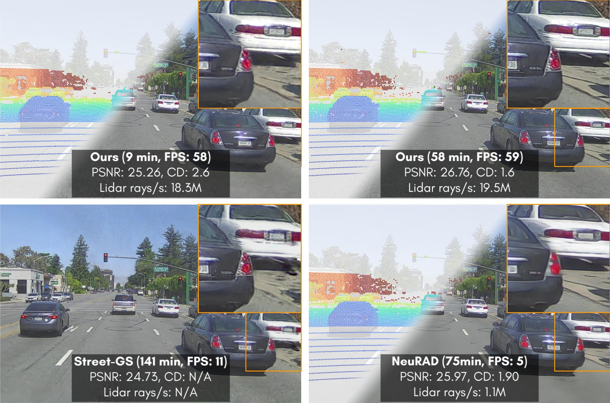

    <!-- project badges -->
    
    <!-- paper badges -->
    

<h3 style="font-size:2.0em;">SplatAD</h3>
<h4 style="font-size:1.5em;">
Real-Time Lidar and Camera Rendering with 3D Gaussian Splatting for Autonomous Driving
</h4>

<picture>
    <source media="(prefers-color-scheme: dark)" srcset="docs/_static/imgs/frontfig-stacked.jpg" />
    
</picture>

[Key Features](#key-features) ·
[Planned Features](#planned-featurestodos) ·
[Project page](https://research.zenseact.com/publications/splatad/)

# About
<h4>Code to be released.</h4>

This is the official repository for [_SplatAD: Real-Time Lidar and Camera Rendering with 3D Gaussian Splatting for Autonomous Driving_](https://arxiv.org/abs/XXXX). The code in this repository builds upon the open-source library [gsplat](https://github.com/nerfstudio-project/gsplat), with modifications and extensions designed for autonomous driving data.

# Key Features
- Efficient lidar rendering
    - Projection to spherical coordinates
    - Depth and feature rasterization for a non-linear grid of points
- Rolling shutter compensation for camera and lidar

# Planned Features/TODOs
- [] Release code